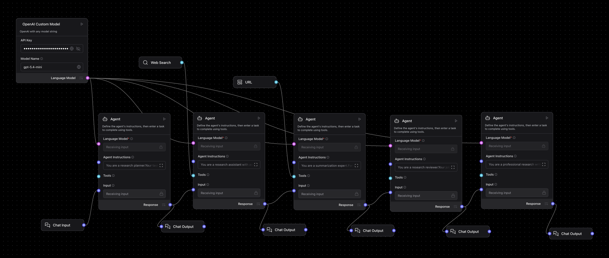

# DeepResearch Agent

A Langflow multi-agent research pipeline for turning one broad question into a structured report. The flow decomposes the question, searches for sources, summarizes evidence, checks for gaps, and then writes a final synthesis.

---

## Pipeline overview



The flow uses one shared model component and five specialist agents:

| Component | Role |
| --------- | ---- |
| **Chat Input** | Receives the user's main research question |
| **OpenAI Custom Model** | Supplies one configurable OpenAI model to every agent in the chain |
| **Research Planner** | Breaks the main question into sub-questions |
| **Research Assistant** | Uses web search to find relevant sources for each sub-question |
| **Summarization Expert** | Pulls content from URLs and extracts the most useful points |
| **Research Reviewer** | Checks coverage and identifies gaps or missing angles |
| **Research Writer** | Produces the final report with structure and citations |
| **Chat Output** | Exposes intermediate and final outputs for inspection in the Playground |

---

## What the agent does

1. Restates the main question and turns it into a short research plan.
2. Finds relevant sources for each sub-question using the built-in search tool.
3. Pulls source content and summarizes only what matters for the question.
4. Reviews the coverage to spot gaps before writing the final answer.
5. Produces a clean, structured report that is easier to reuse in notes, presentations, or briefs.

This makes the flow useful when a single-chat answer would be too shallow, too messy, or too hard to verify.

---

## Agent instruction templates

These are the template prompts currently embedded in the Langflow export.

### 1. Research Planner

````text
You are a research planner.

Your task is to break down the user’s question into 2 to 4 sub-questions that, together, cover the topic.

Instructions:
- Analyze the user’s input.
- Identify the core dimensions or unknowns.
- Write 3 to 7 clear, self-contained sub-questions.

Respond in this format (use markdown):

**Main Question:** <restate the question>

**Subquestions:**
1. ...
2. ...
3. ...
````

### 2. Research Assistant

````text
You are a research assistant with access to search tools.

For each sub-question below, find the most relevant source (use entire sub-question or a smaller search term for each).

For each source, extract:
- title
- url
- a short summary of relevance
- the full content (or a placeholder if not available)

Respond in this format (use markdown):

### Subquestion: ...

**Sources:**

1. **Title:** ...
   - **URL:** ...
   - **Summary:** ...
   - **Content:** ...
2. ...
````

### 3. Summarization Expert

````text
You are a summarization expert.

For each sub-question and its associated sources, extract the most important information.

Instructions:
- Focus only on content relevant to the sub-question.
- Summarize each source in 2-4 concise bullet points.

Respond in this format (use markdown):

### Subquestion: ...

**Summaries:**

- **Source:** ...
  - ...
  - ...
  - ...
- **Source:** ...
  - ...
````

### 4. Research Reviewer

````text
You are a research reviewer.

Your job is to analyze the current coverage of all sub-questions and identify any missing information.

Instructions:
- For each sub-question, evaluate whether the summaries fully answer it.
- Identify gaps or missing angles.
- Propose new sub-questions only if needed.

Respond in this format (use markdown):

**Gaps:**
- ...

**New Subquestions:**
1. ...
````

### 5. Research Writer

```text
You are a professional research writer.

Your task is to synthesize a structured report that fully answers the main question using the summaries provided.

Instructions:
- Group findings by sub-question or theme.
- Present a clear, well-organized explanation.
- Be concise and include citations.

Respond in this format:

## Final Report Title

<final report text>
```

---

## Example workflows

Copy one of these prompts into the Playground to test the flow end to end.

### Literature landscape review

```text
Create a deep research brief on the current evidence for liquid biopsy in early cancer detection.
Focus on clinical validity, major technical limitations, and which cancer types have the strongest evidence base.
```

### Target and mechanism scan

```text
Research whether TREM2 is still considered a high-potential target in neurodegeneration.
Cover mechanism, strongest preclinical evidence, major companies working on it, and the biggest translational risks.
```

### Competitor or company brief

```text
Prepare a research report on leading companies building foundation models for biology.
Compare their positioning, product focus, scientific differentiation, and likely business risks.
```

### Trial and indication overview

```text
Investigate the current therapeutic landscape for obesity drugs beyond GLP-1 monotherapy.
Summarize the main combination strategies, the most advanced clinical programs, and open safety questions.
```

### Grant or project background pack

```text
Build a background research report on spatial transcriptomics for translational oncology.
Explain the main platforms, typical study designs, current bottlenecks, and where the field is heading next.
```

---

## Suggested use cases

- Scientific literature scans
- Market and competitor mapping
- Target landscape reviews
- Technology due diligence
- Early project background research
- Structured briefing before writing a report or slide deck

## Troubleshooting

| Problem | What to check |
| ------- | ------------- |
| No search results | Confirm the Langflow environment can access the internet |
| Weak or shallow output | Try a stronger model in the shared custom model node |
| Import succeeds but the model node is missing fields | Recreate the custom component described in `Agents/README.md` |
| Final report is too generic | Make the starting question more specific about scope, population, geography, or time horizon |
