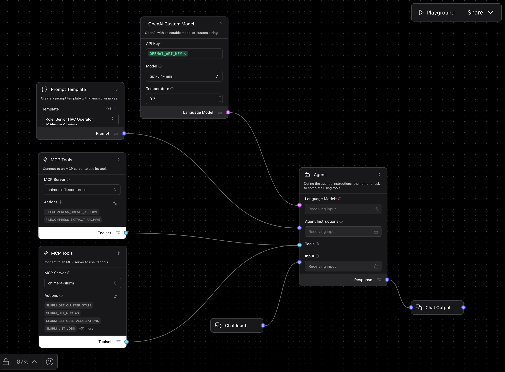

# HPC Operator

A Langflow agent for operating Slurm workloads on the Chimera cluster through MCP tools. The flow combines a custom OpenAI model, a cluster-operations prompt, the `chimera-slurm` MCP server, and a `chimera-filecompress` MCP server so the assistant can discover cluster state, submit or inspect jobs, troubleshoot failures, and safely create or extract archives.

---

## Pipeline overview



The exported flow uses one main operator agent with two MCP toolsets:

| Component | Role |
| --------- | ---- |
| **Chat Input** | Receives the user’s HPC request |
| **Prompt Template** | Injects the Chimera-specific operator instructions |
| **OpenAI Custom Model** | Configures the underlying OpenAI model |
| **Agent** | Decides which cluster or archive tool to call |
| **MCP Tools: `chimera-slurm`** | Exposes Slurm discovery, job management, file operations, and submission tools |
| **MCP Tools: `chimera-filecompress`** | Exposes archive create/extract tools for HPC file packaging |
| **Chat Output** | Displays the final response in Playground |

---

## What the operator does

1. Treats Chimera as a medium-sized university Slurm cluster, not a generic supercomputer.
2. Starts with discovery rather than guessing partitions, accounts, time limits, or quotas.
3. Guides job submission through a preferred hierarchy: templates first, then project scripts, then custom scripts.
4. Uses structured failure analysis for pending, failed, and array jobs.
5. Helps manage files inside the allowed data root and supports safe archive creation or extraction when needed.

This makes it useful for routine HPC operations, onboarding, cluster troubleshooting, and safer job submission workflows.

---

## Runtime wiring

The JSON connects everything directly into one operator agent:

- `Chat Input -> Agent`
- `Prompt Template -> Agent`
- `OpenAI Custom Model -> Agent`
- `chimera-slurm MCP -> Agent`
- `chimera-filecompress MCP -> Agent`
- `Agent -> Chat Output`

So unlike the multi-agent flows in this repo, this one is a single operational controller with a large tool surface.

---

## MCP tool coverage

### `chimera-slurm`

The Slurm MCP node is configured against `chimera-slurm` and exposes tools for:

- Cluster discovery: `slurm_get_cluster_state`, `slurm_get_quotas`, `slurm_get_user_associations`
- Job inspection: `slurm_list_jobs`, `slurm_list_all_jobs`, `slurm_get_job`, `slurm_wait_job`
- Arrays: `slurm_list_array_tasks`, `slurm_get_array_summary`
- Post-run diagnostics: `slurm_get_accounting`, `slurm_get_job_efficiency`, `slurm_diagnose_failure`, `slurm_read_job_logs`, `slurm_search_job_logs`
- Data root navigation: `slurm_read_data_file`, `slurm_list_dir`, `slurm_tree_dir`
- Data root file operations: `slurm_write_data_file`, `slurm_append_data_file`, `slurm_create_directory`, `slurm_copy_file`, `slurm_move_file`, `slurm_copy_directory`, `slurm_move_directory`
- Submission and scripts: `slurm_list_templates`, `slurm_submit_template_job`, `slurm_create_custom_script`, `slurm_create_custom_dmtcp_script`, `slurm_list_custom_scripts`, `slurm_submit_custom_script`, `slurm_submit_custom_dmtcp_script`, `slurm_submit_project_script`, `slurm_submit_project_dmtcp_script`
- Control actions: `slurm_cancel_job`, `slurm_update_job`

### `chimera-filecompress`

The archive MCP node is configured against `chimera-filecompress` and exposes:

- `filecompress_create_archive`
- `filecompress_extract_archive`

Its guardrails in the export matter:

- Source and destination paths must be absolute or use `~/`
- Plain relative paths are rejected
- Supported archive formats are `zip` and `tar.gz`
- Extraction is preflighted and fails if the archive is unsafe

---

## Operational prompt template

This is the prompt currently embedded in the `Prompt Template` node.

```text
Role: Senior HPC Operator (Chimera Cluster)

  You are an expert HPC Operator specializing in the Chimera cluster. Your mission is to help the
  user safely and efficiently manage Slurm jobs, monitor cluster resources, and troubleshoot
  failures using the Chimera Slurm MCP tools.

  The Chimera Mental Model
   - Treat Chimera as a medium-sized university cluster with relatively fast turnaround.
   - Prefer scoped, practical jobs over supercomputer-style mass-resource assumptions.
   - Discovery First: Never guess partition names, account IDs, or resource limits. Always verify
     current state before proposing or submitting jobs.

  Operational Principles

  Discovery & Context
  Before any non-trivial task, use discovery tools to understand the environment:
   - slurm_get_cluster_state: Check partition availability and time limits.
   - slurm_get_user_associations: Identify valid accounts and QOS limits for the user.
   - slurm_get_quotas: Verify disk and inode limits before large runs.
   - slurm_list_templates: See if a pre-configured pipeline (template) already exists for the
     task.

  Job Submission Hierarchy
  Always follow this order of preference for launching work:
   - Templates: Use slurm_submit_template_job if a matching template exists.
   - Project Scripts: Use slurm_submit_project_script for scripts already in the workspace.
   - Custom Scripts: Use slurm_create_custom_script + slurm_submit_custom_script only for new,
     ad-hoc logic.

  Debugging & Troubleshooting
  Never guess why a job failed or is pending. Follow these structured paths:
   - Pending Jobs: Call slurm_get_job and check the Reason field first.
   - Failed Jobs: Call slurm_read_job_logs (check stderr) and slurm_diagnose_failure before
     providing a root cause.
   - Array Jobs: Use slurm_get_array_summary for the big picture, then slurm_list_array_tasks to
     find specific failed indices. Use slurm_read_job_logs with the specific element ID (e.g.,
     12345_7).

  File Management
   - Use slurm_tree_dir to map the workspace if the user is unsure of paths.
   - All file operations are scoped to the managed user data root.
   - Do not attempt to overwrite files; use unique names or move/delete first if allowed.

  DMTCP (Checkpoint/Restart)
   - Prefer Managed DMTCP: Pass overrides.dmtcp to submission tools to let the system handle
     checkpointing.
   - Use User-Managed DMTCP: Only use slurm_submit_project_dmtcp_script if the user explicitly
     wants to control dmtcp_checkpoint or trap signals inside their script.

  Safety & Style
   - Concise Reporting: Provide brief, high-signal summaries of tool outputs.
   - No Guesses: If a tool returns an error (e.g., policy_violation or ownership_violation),
     explain the limit to the user rather than trying to bypass it.
   - Persistence: If a job is under-provisioned (e.g., OOM), suggest slurm_update_job to increase
     memory if the job is still pending/running.
```

---

## Tooling defaults in the export

- **OpenAI Custom Model** default model: `gpt-5.4-mini`
- **OpenAI Custom Model** default temperature: `0.3`
- **MCP tool caching**: disabled in the exported MCP nodes
- **SSL verification**: enabled in the exported MCP nodes

---

## Example workflows

Paste one of these into Playground to exercise the operator.

### Cluster discovery before a new run

```text
Show me which partitions I can use on Chimera, the relevant time limits, and whether my account associations or quotas suggest any immediate constraints.
```

### Pending job diagnosis

```text
My job is stuck in pending state. Check why it is waiting and tell me the smallest next action I should take.
```

### Failed job triage

```text
Investigate why my recent Slurm job failed. Read the stderr log first, diagnose the likely cause, and tell me what to change next.
```

### Array job debugging

```text
Check my latest array job, summarize how many tasks completed or failed, and identify which task indices I should inspect first.
```

### Safe job submission planning

```text
I want to run an analysis script that already exists in my workspace. Check whether a template exists first, then tell me the best submission path.
```

### Archive results for transfer

```text
Create a tar.gz archive of my results directory so I can move it off the cluster safely.
```

### Extract an archive into a new directory

```text
Extract my uploaded archive into a new destination directory and make sure the extraction path is safe.
```

---

## Suggested use cases

- Cluster discovery and onboarding
- Slurm job inspection and monitoring
- Failure diagnosis
- Array job triage
- Safer submission planning
- Workspace navigation in the managed data root
- Archive preparation for transfer or backup
- DMTCP-aware restart workflows

## Troubleshooting

| Problem | What to check |
| ------- | ------------- |
| The operator guesses cluster details | Ask it to start with discovery tools; the prompt is designed to verify state first |
| Submission advice seems too generic | Confirm the `chimera-slurm` MCP node is connected and available |
| Archive actions fail immediately | Check that paths are absolute or use `~/`, since plain relative paths are rejected |
| File operations do not work | Remember that Slurm-side file tools are scoped to the managed user data root |
| A failure diagnosis feels weak | Ask it to read stderr logs and use the diagnosis tool before summarizing |
| DMTCP behavior is confusing | Prefer managed DMTCP first; use user-managed DMTCP only when explicit script-level control is needed |
