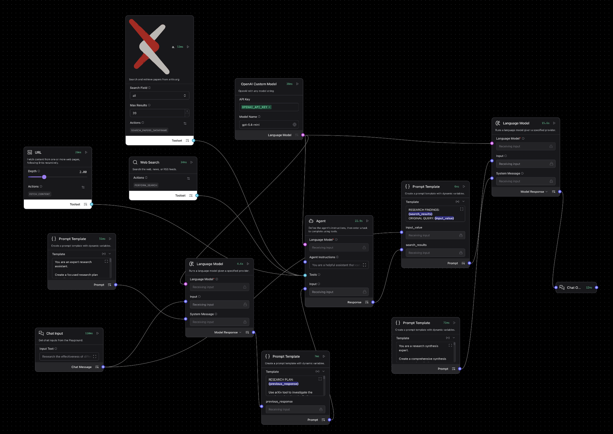

# Literature Agent

A Langflow literature-review pipeline for turning one research question into a structured evidence summary. The flow first creates a focused research plan, then runs a tool-using search agent across `arXiv`, web search, and URL fetching, and finally synthesizes the findings into a report with source links.

---

## Pipeline overview



The exported flow contains three main stages:

| Component | Role |
| --------- | ---- |
| **Chat Input** | Receives the user’s literature question |
| **Prompt Template: Research Plan** | Instructs the first model to generate a focused search plan |
| **Language Model: Planning** | Produces the research objective, search queries, and priorities |
| **Prompt Template: Search Execution** | Converts the plan into instructions for the search agent |
| **Agent** | Uses literature-search tools to gather evidence |
| **arXiv** | Searches academic papers from arXiv.org |
| **Web Search** | Searches the broader web for additional sources |
| **URL** | Fetches and extracts content from candidate pages |
| **Prompt Template: Findings Packaging** | Combines research findings with the original question |
| **Prompt Template: Final Synthesis** | Instructs the final model to write the literature report |
| **Language Model: Synthesis** | Produces the final report with cited source links |
| **Chat Output** | Displays the synthesized final answer |

---

## What the agent does

1. Converts a broad literature question into a concrete search plan.
2. Generates several search queries rather than relying on a single phrasing.
3. Uses `arXiv` for academic retrieval and general web search plus URL fetching for broader coverage.
4. Packages the gathered findings back into a final synthesis stage.
5. Produces a report with an executive summary, methodology, findings, conclusions, and future directions.

This makes it useful for fast literature scanning, background research, topic overviews, and early-stage evidence gathering before a deeper manual review.

---

## Runtime wiring

The JSON uses a staged pipeline rather than a single direct chat agent:

1. `Chat Input -> Planning Language Model`
2. `Research Plan Prompt -> Planning Language Model (system message)`
3. `Planning Language Model -> Search Execution Prompt`
4. `Search Execution Prompt -> Agent`
5. `arXiv`, `Web Search`, and `URL` -> Agent as tools
6. `Agent -> Findings Packaging Prompt`
7. `Findings Packaging Prompt -> Final Language Model (input)`
8. `Final Synthesis Prompt -> Final Language Model (system message)`
9. `Final Language Model -> Chat Output`

So the middle agent is responsible for tool use, while the first and last language model nodes handle planning and synthesis.

---

## Prompt templates

These are the embedded prompt templates currently stored in the flow.

### 1. Research plan prompt

```text
You are an expert research assistant.

Create a focused research plan that will guide our search.

Format your response exactly as:

RESEARCH OBJECTIVE:
[Clear statement of research goal]

KEY SEARCH QUERIES:
1. [Primary academic search query]
2. [Secondary search query]
3. [Alternative search approach]

SEARCH PRIORITIES:
- [What types of sources to focus on]
- [Key aspects to investigate]
- [Specific areas to explore]
```

### 2. Search execution prompt

```text
RESEARCH PLAN: {previous_response}

Use arXiv tool to investigate the queries and analyze the findings.
Focus on academic and reliable sources.

Steps:
1. Search using provided queries
2. Analyze search results
3. Verify source credibility
4. Extract key findings

Format findings as:

SEARCH RESULTS:
[Key findings from searches]

SOURCE ANALYSIS:
[Credibility assessment]

MAIN INSIGHTS:
[Critical discoveries]

EVIDENCE QUALITY:
[Evaluation of findings]
```

### 3. Findings packaging prompt

```text
RESEARCH FINDINGS: {search_results}
ORIGINAL QUERY: {input_value}
```

### 4. Final synthesis prompt

```text
You are a research synthesis expert.

Create a comprehensive synthesis and report of our findings.

Format your response as:

EXECUTIVE SUMMARY:
[Key findings and implications]

METHODOLOGY:
- Search Strategy Used
- Sources Analyzed
- Quality Assessment

FINDINGS & ANALYSIS:
[Detailed discussion of discoveries]

CONCLUSIONS:
[Main takeaways and insights]

FUTURE DIRECTIONS:
[Suggested next steps]

IMPORTANT: For each major point or finding, include the relevant source link in square brackets at the end of the sentence or paragraph. For example: "Harvard has developed a solid-state battery that charges in minutes. [Source: https://example.com/article]"
```

---

## Tooling defaults in the export

These defaults shape how the flow behaves out of the box:

- **Shared custom model**: `gpt-5.4-mini`
- **Custom model pattern**: any valid OpenAI model string can be typed directly
- **Planning language model temperature**: `0.1`
- **Final synthesis language model temperature**: `0.1`
- **arXiv search field**: `all`
- **arXiv max results**: `20`
- **URL fetch depth**: `2`
- **URL output format**: `Text`
- **URL prevent outside domain**: enabled
- **URL async loading**: enabled

The `Web Search` node is present as a general search fallback, but its behavior depends on the underlying Langflow search component rather than a domain-specific academic index.

---

## Search sources in this flow

### `arXiv`

The custom `arXiv` component queries `export.arxiv.org` and returns structured paper metadata including:

- paper ID
- title
- summary
- authors
- publication and update dates
- arXiv URL
- PDF URL
- journal reference when available
- primary category and category list

It supports search over:

- all fields
- title
- abstract
- author
- category

### `Web Search`

This node broadens the search beyond `arXiv`, which is useful when:

- the topic is highly applied
- you want review articles, blogs, or institutional summaries
- the evidence base includes non-arXiv sources
- you want broader context around real-world deployment

### `URL`

The URL node fetches page content recursively and can extract clean text from source pages. In this flow it helps turn candidate web hits into readable content for downstream synthesis.

---

## Example workflows

Copy one of these into Playground to test the flow.

### Prompt engineering and hallucinations

```text
Research the effectiveness of different prompt engineering techniques in controlling AI hallucinations, with focus on real-world applications and empirical studies.
```

### Biomarker literature scan

```text
Review the recent literature on circulating tumor DNA for early cancer detection, with emphasis on sensitivity, specificity, and real clinical limitations.
```

### Method comparison

```text
Compare the literature on spatial transcriptomics platforms for translational oncology, focusing on major methods, strengths, weaknesses, and practical adoption barriers.
```

### Safety and evaluation topic

```text
Survey the literature on evaluation methods for large language model reliability in healthcare, including benchmark design, failure modes, and external validation.
```

### Target landscape overview

```text
Summarize the literature around TREM2 as a therapeutic target in neurodegeneration, including mechanistic evidence, translational risks, and unresolved questions.
```

### Technical field overview

```text
Review the literature on multimodal foundation models in biology, focusing on model design, training data, main use cases, and current limitations.
```

---

## Suggested use cases

- Fast literature scans
- Topic background briefs
- Early evidence mapping
- Research-question framing
- Multi-source paper and web synthesis
- Preparation before manual paper review

---

## Troubleshooting

| Problem | What to check |
| ------- | ------------- |
| The report feels too broad | Make the original query more specific about population, method, timeframe, or outcome |
| Too much web content and not enough papers | Ask for stronger emphasis on `arXiv` or academic sources in the question |
| Weak source coverage | Try narrower queries, or ask for a focused follow-up on one subtopic |
| Final synthesis lacks enough links | The final prompt expects source links; if missing, inspect whether the middle search stage returned usable URLs |
| Results are noisy | Reduce scope or ask for a review limited to specific evidence types such as empirical studies, benchmarks, or reviews |
