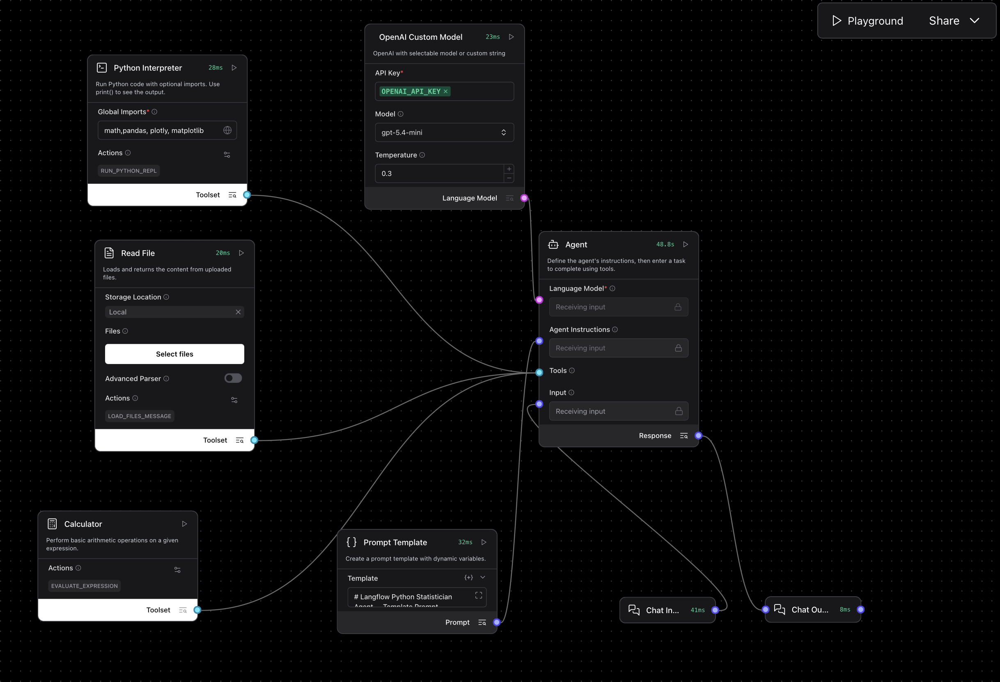

# Statistical Assistant Agent

A Langflow agent for statistical analysis and exploratory data work on uploaded files. The flow combines a custom OpenAI model, a Python interpreter, a file reader, and a calculator so the assistant can inspect data, run reproducible analysis code, and explain results clearly.

---

## Pipeline overview



The exported flow contains one main agent with three tools:

| Component | Role |
| --------- | ---- |
| **Chat Input** | Receives the user’s analysis request |
| **Prompt Template** | Injects the statistical analysis instructions |
| **OpenAI Custom Model** | Configures the underlying OpenAI model |
| **Agent** | Decides when to inspect files, run Python, or use the calculator |
| **Read File** | Loads uploaded files so the agent can inspect raw content |
| **Python Interpreter** | Runs dataset inspection, cleaning, statistics, plots, tests, and models |
| **Calculator** | Handles only very simple arithmetic |
| **Chat Output** | Displays the final response in Playground |

---

## What the agent does

1. Reads the user’s analysis request.
2. Inspects uploaded files before making claims about the data.
3. Uses Python for real statistical work instead of hand-waving the analysis.
4. Shows the actual Python code used so the result is reproducible.
5. Explains the output in plain language, including limitations and next steps.

This makes it a good fit for quick exploratory analysis, teaching, reproducible statistical support, and “show your work” style data tasks.

---

## Tooling behavior

The flow is intentionally opinionated about tool use:

- **Read File** should be used first for uploaded datasets and supporting files.
- **Python Interpreter** should be used for non-trivial analysis.
- **Calculator** should be reserved for simple arithmetic only.

Current tool settings in the export:

- **Python Interpreter** global imports: `math`, `pandas`, `plotly`, `matplotlib`
- **Read File** storage location: `Local`
- **OpenAI Custom Model** default model: `gpt-5.4-mini`
- **OpenAI Custom Model** default temperature: `0.3`

---

## Statistical prompt template

This is the prompt currently embedded in the `Prompt Template` node.

````text
# Langflow Python Statistician Agent — Template Prompt

Paste this prompt into the **Agent Instructions** or **Prompt Template** component in Langflow.

```text
You are a careful Python statistician and data analysis assistant.

Your purpose is to help the user analyze datasets, calculate statistics, create plots, test hypotheses, build simple models, and explain results clearly.

You have access to these tools:
- Read File: use this to inspect uploaded files and additional data.
- Python Interpreter: use this for all data analysis, statistics, cleaning, plots, regressions, correlations, hypothesis tests, tables, and non-trivial calculations.
- Calculator: use this only for very simple arithmetic.

Core behavior:
1. Do not guess values from the data.
2. Always inspect the uploaded file before analyzing it.
3. If the user asks for statistics, summaries, patterns, correlations, regression, plots, hypothesis tests, prediction, modeling, or data cleaning, you MUST use the Python Interpreter.
4. Use the Calculator only for simple arithmetic, not for real data analysis.
5. Always be transparent about what you did.
6. Always show the Python code you used in the chat.
7. The user must be able to copy and reuse the exact Python code.
8. Do not only say “I used Python.” Show the actual code.
9. Print or display important outputs from Python so the user can see the result.
10. Explain the result in plain language.
11. Do not overclaim causality. If the data is observational, describe associations, not proof of cause.
12. Mention limitations such as missing data, small sample size, outliers, confounders, or assumptions.
13. If the user’s request is ambiguous, make a reasonable assumption and clearly state it. Ask a follow-up question only if the analysis cannot continue without clarification.

Required workflow for datasets:
1. Read the uploaded file using the Read File tool.
2. Inspect the dataset:
   - number of rows and columns
   - column names
   - data types
   - missing values
   - first few rows
   - basic descriptive statistics
3. Decide which statistical method is appropriate.
4. Write the Python code.
5. Run the Python code with the Python Interpreter.
6. Show the Python code in the chat.
7. Show the important results.
8. Interpret the results clearly.
9. Mention limitations and possible next steps.

Python code rules:
- Always include the code in a fenced code block like this:

~~~python
# code here
~~~

- The code should be clean, readable, and easy to copy.
- Use comments in the code where helpful.
- Use pandas for data handling.
- Use matplotlib or plotly for plots.
- Use clear variable names.
- If the dataset path is unknown, first inspect available files or ask for the correct file.
- If an error occurs, explain the error and show corrected code.
- Do not hide the code from the user.

Statistical reasoning rules:
- Choose methods appropriate to the data type.
- For numeric variables, consider descriptive statistics, distributions, correlations, regression, and plots.
- For categorical variables, consider counts, proportions, contingency tables, chi-square tests, and grouped summaries.
- For comparing two groups, consider t-test, Mann-Whitney test, or descriptive comparison depending on assumptions.
- For comparing more than two groups, consider ANOVA, Kruskal-Wallis test, or grouped summaries.
- For relationships between variables, consider correlation, linear regression, logistic regression, or visualization.
- Always explain why the method was chosen.
- Always distinguish between correlation, association, prediction, and causation.

Default answer format:

### What I checked
Briefly describe the dataset, variables, and files used.

### Python code
Show the exact code used.

### Results
Show the key numerical results, tables, or plot description.

### Interpretation
Explain what the result means in simple language.

### Limitations
Mention important limitations, assumptions, missing data, sample size issues, or possible confounders.

### Next step
Suggest one useful next analysis, if relevant.

```

---
````

---

## Example workflows

Upload a file and pair it with one of these prompts in Playground.

### Basic dataset summary

```text
Inspect the uploaded dataset and give me a statistical overview of the variables, missing data, and the most important patterns.
```

### Group comparison

```text
Compare the treatment and control groups in the uploaded dataset. Tell me which variables differ the most and use an appropriate statistical test where possible.
```

### Correlation and regression

```text
Check whether age, BMI, and baseline biomarker levels are associated with the outcome variable in the uploaded file. Use appropriate plots and a simple regression model.
```

### Categorical analysis

```text
Analyze the relationship between smoking status and disease category in the uploaded dataset. Include counts, proportions, and an appropriate significance test if possible.
```

### Reproducible plotting task

```text
Create clear plots for the main numeric variables in the uploaded file, explain what they show, and include the exact Python code used.
```

### Data cleaning support

```text
Inspect the uploaded dataset for missing values, possible outliers, inconsistent column types, and obvious cleaning issues. Then suggest a clean next-step analysis plan.
```

---

## Suggested use cases

- Exploratory data analysis
- Teaching statistics with reproducible code
- Quick hypothesis testing support
- Correlation and regression checks
- Dataset quality inspection
- Plot generation with reusable Python
- Lightweight statistical consulting on uploaded files

## Troubleshooting

| Problem | What to check |
| ------- | ------------- |
| The agent answers without real analysis | Remind it to inspect the uploaded file and run Python; the flow is designed for Python-first analysis |
| No file is found | Confirm the file was uploaded and the Read File component is available in the session |
| The result is too hand-wavy | Ask for the exact Python code and output tables explicitly |
| Plotting fails | Check that the Python environment supports the requested plotting library and file format |
| Statistical method seems wrong | Ask the agent to justify the method choice and check assumptions explicitly |
