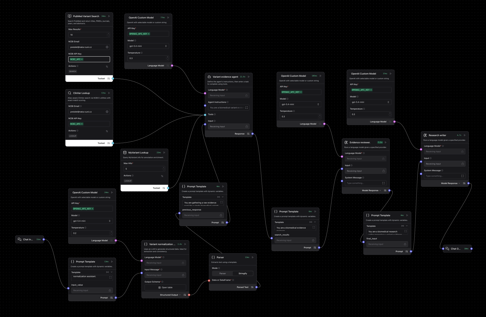
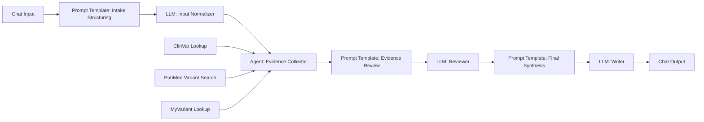

# Variant Interpretation Research Agent

A Langflow research workflow for structured evidence gathering around a single human variant. The first implementation is intentionally narrow: it is optimized for germline-style variant research questions where ClinVar should be the primary interpretation source and PubMed provides supporting literature context.

---

## Pipeline overview



The exported Langflow file is [`VariantInterpretationResearchAgent.json`](/Users/preislet/Documents/RSE/Agentic-Systems-in-Biomedicine/Agents/VariantInterpretationResearchAgent/VariantInterpretationResearchAgent.json).

The flow uses one normalization stage, one tool-using evidence collector, and two downstream review and writing stages:

| Component | Role |
| --------- | ---- |
| **Chat Input** | Receives the user request |
| **Prompt Template: Intake Structuring** | Frames the normalization task |
| **LLM: Input Normalizer** | Converts a free-text question into structured variant fields |
| **ClinVar Lookup** | Pulls primary interpretation evidence from ClinVar |
| **PubMed Variant Search** | Retrieves exact-variant literature support |
| **MyVariant Lookup** | Adds annotation and identifier enrichment |
| **Agent: Evidence Collector** | Chooses tools and gathers evidence |
| **Prompt Template: Evidence Review** | Packages tool output for critical review |
| **LLM: Reviewer** | Checks evidence quality and gaps |
| **Prompt Template: Final Synthesis** | Frames the final answer |
| **LLM: Writer** | Produces the final research brief |
| **Chat Output** | Displays the result in Playground |

---

## Goal

This agent is meant to answer questions like:

- What does ClinVar report for this exact variant?
- Are there conflicting interpretations?
- What literature discusses this exact variant?
- Is the evidence exact-variant evidence, or only gene-level context?

It is not intended to produce clinical advice or a formal ACMG classification.

---
## Logical chart



---

## Import and setup

1. Import [`VariantInterpretationResearchAgent.json`](/Users/preislet/Documents/RSE/Agentic-Systems-in-Biomedicine/Agents/VariantInterpretationResearchAgent/VariantInterpretationResearchAgent.json) into Langflow.
2. Point Langflow at [`custom_components/`](/Users/preislet/Documents/RSE/Agentic-Systems-in-Biomedicine/Agents/VariantInterpretationResearchAgent/custom_components) with `LANGFLOW_COMPONENTS_PATH`.
3. Add your OpenAI API key to the `OpenAI Custom Model` node.
4. Add your NCBI email to both `ClinVar Lookup` and `PubMed Variant Search`.
5. Add the same optional NCBI API key to both NCBI-backed components if you want higher rate limits during repeated testing.

---

## NCBI API key

The `ClinVar Lookup` and `PubMed Variant Search` components both call NCBI E-utilities.

- For light manual use, the API key is optional.
- For repeated Playground testing or agent runs, it is strongly recommended because NCBI applies stricter rate limits without a key.
- The `email` field should also be filled in on both components.

How to obtain the key:

1. Create or sign in to your [My NCBI account](https://www.ncbi.nlm.nih.gov/account/).
2. Open your [NCBI Account Settings](https://www.ncbi.nlm.nih.gov/account/settings/).
3. Scroll to `API Key Management`.
4. Click `Create API Key` and copy the generated key.
5. Paste that key into the `NCBI API Key` field in both Langflow components.

Official references:

- [NCBI E-utilities overview](https://www.ncbi.nlm.nih.gov/home/develop/api/)
- [NCBI API key documentation](https://www.ncbi.nlm.nih.gov/datasets/docs/v2/api/api-keys/)
- [Entrez Programming Utilities help](https://www.ncbi.nlm.nih.gov/books/NBK25497/)

---

## Required tools

### 1. `ClinVar Lookup`

Use the custom component in [clinvar_lookup.py](/Users/preislet/Documents/RSE/Agentic-Systems-in-Biomedicine/Agents/VariantInterpretationResearchAgent/custom_components/biomed/clinvar_lookup.py).

This tool should be the first source consulted for:

- exact variant match
- clinical significance
- review status
- linked conditions
- candidate conflicts

### 2. `PubMed Variant Search`

Use the custom component in [pubmed_variant_search.py](/Users/preislet/Documents/RSE/Agentic-Systems-in-Biomedicine/Agents/VariantInterpretationResearchAgent/custom_components/biomed/pubmed_variant_search.py) for exact-variant literature support.

### 3. `MyVariant Lookup`

Use the custom component in [myvariant_lookup.py](/Users/preislet/Documents/RSE/Agentic-Systems-in-Biomedicine/Agents/VariantInterpretationResearchAgent/custom_components/biomed/myvariant_lookup.py). It should be used only as enrichment and should not outrank ClinVar for interpretation claims.

---

Important note:

The custom ClinVar component exposes `query`, `gene`, `variant`, and `alias_queries` in tool mode. That means the agent can pass these fields dynamically during tool calling instead of depending on static values typed into the component.

---

## Recommended agent instructions

Paste this into the `Evidence Collector Agent` instructions.

```text
You are a biomedical variant evidence agent.

Your job is to gather research evidence about a single human variant.

Rules:
- This is for research use only, not clinical advice.
- Use ClinVar Lookup first as the primary source for interpretation evidence.
- When possible, call ClinVar Lookup with:
  - query: one combined search string
  - gene: the gene symbol
  - variant: the preferred normalized variant string
  - alias_queries: legacy names, alternate HGVS forms, and rsIDs
- If ClinVar exact_match_found is true, treat top_match as the primary database result.
- If ClinVar exact_match_found is false, say primary database matching was not confirmed.
- Do not hide database retrieval failures behind confident language.
- Use PubMed Variant Search next for exact-variant literature.
- Use MyVariant Lookup only for annotation enrichment.
- Prefer exact-variant evidence over gene-level background.
```

---

## Recommended normalization output

Your first LLM stage should try to produce structured fields like:

```json
{
  "gene": "BRCA1",
  "variant_input": "185delAG",
  "variant_normalized_best_effort": "c.68_69delAG",
  "condition": "hereditary breast and ovarian cancer",
  "assumed_variant_mode": "germline",
  "alias_queries": [
    "BRCA1 185delAG",
    "BRCA1 c.68_69delAG",
    "BRCA1 c.68_69del",
    "NM_007294.3(BRCA1):c.68_69delAG",
    "rs386833395"
  ]
}
```

---

## Best test case

Use this as the first end-to-end test:

```text
Assess exact-variant evidence, database support, and literature-based relevance for BRCA1 c.68_69delAG / 185delAG in hereditary breast and ovarian cancer.
```

What should happen:

- ClinVar should find an exact match
- the tool output should indicate `exact_match_found: true`
- the top match should contain ClinVar-specific fields rather than only literature-derived wording

---

## Example prompts

Copy one of these into Playground to test the exported flow.

### Exact variant evidence

```text
Assess exact-variant evidence, database support, and literature-based relevance for BRCA1 c.68_69delAG / 185delAG in hereditary breast and ovarian cancer.
```

### Alias-aware retrieval

```text
Investigate whether CFTR F508del and c.1521_1523delCTT resolve to the same exact variant in ClinVar, and summarize the variant-specific evidence rather than gene-level background.
```

### Conflict-focused review

```text
Summarize ClinVar interpretation, review status, and supporting literature for TP53 p.Arg248Gln, and make clear whether the evidence is exact-variant evidence or only broader TP53 context.
```

### Condition-aware lookup

```text
Review the exact-variant evidence for LDLR c.1775G>A in familial hypercholesterolemia, including ClinVar significance, linked conditions, and the strongest variant-specific papers.
```

### Retrieval failure handling

```text
Check ClinVar and PubMed for exact-variant evidence on PALB2 c.3113G>A in hereditary breast cancer, and if exact matching is uncertain, say that explicitly before summarizing any supporting context.
```

---

## Troubleshooting

| Problem | What to check |
| ------- | ------------- |
| Agent says ClinVar was not found for a famous variant | Confirm the tool received `gene`, `variant`, and `alias_queries`, not only `query` |
| Tool works by itself but not in the agent | Check that `Chat Input` is connected to the agent and that the agent prompt explicitly prioritizes `ClinVar Lookup` |
| ClinVar results are too vague | Turn on `include_raw` temporarily and inspect candidate record fields |
| Agent still writes a polished answer after tool failure | Tighten the reviewer and writer prompts so missing primary evidence is stated plainly |

---

## Practical scope

This is a strong V1 for germline-style variant research briefs. Once the ClinVar path is stable, the next upgrades would be:

- alias-aware PubMed search
- better protein and transcript normalization
- separate somatic mode
- optional ACMG evidence scaffolding
